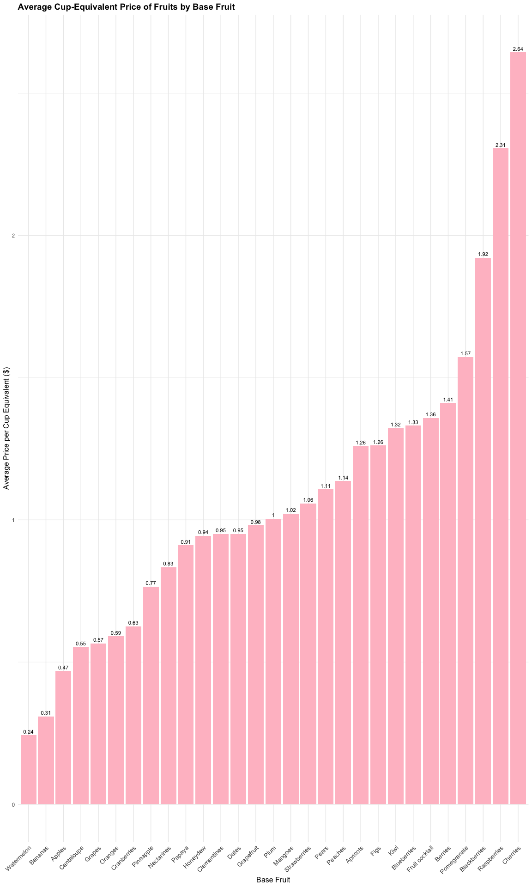
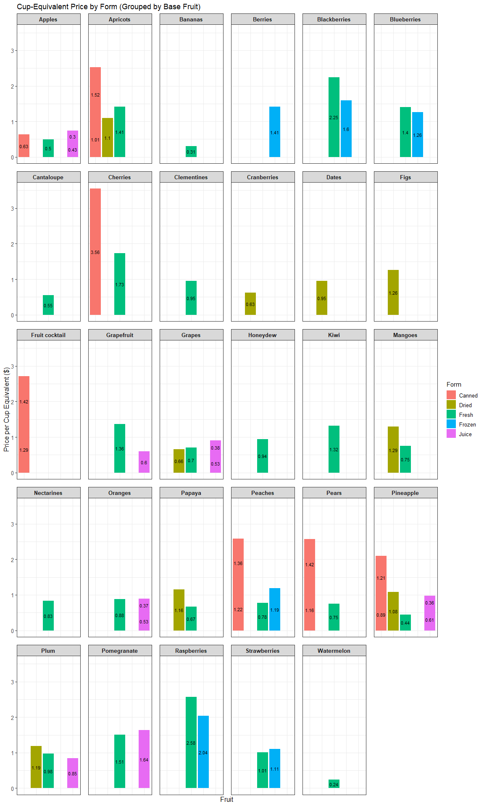
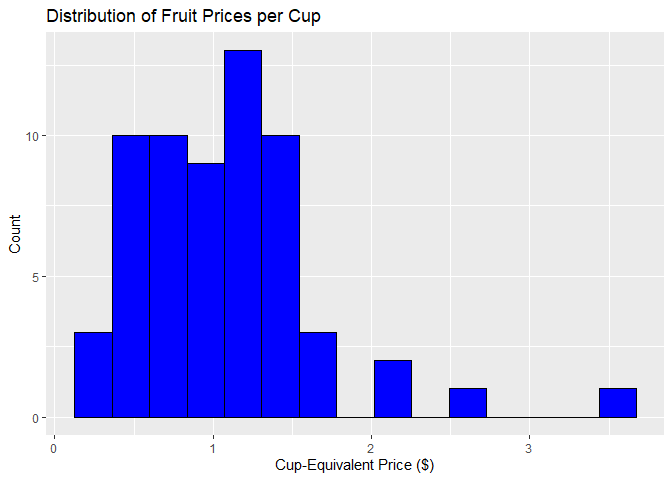
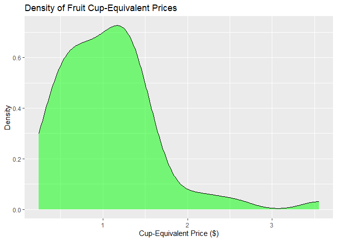

Affordability of Fresh Fruits in the U.S. in 2022: A Cup-Equivalent
Price Analysis
================
Sarah Yao, Isabel Lange
2025-12-03

## Introduction

The goal of this project is to analyze the affordability of fruits in
the United States in 2022, focusing on their price per edible cup
equivalent. Access to nutritious fruits is a key component of a healthy
diet, yet prices vary widely depending on fruit type and form (fresh,
frozen, canned, juice). Understanding which fruits are most and least
affordable can help consumers make informed dietary choices and
highlight potential areas for improving access to nutritious foods.

In pursuit of the stated goal, we will explore the following questions:

**1. Which fruits are most and least affordable per edible cup
equivalent?**

We will sort all fruits by cup-equivalent price and identify the top 5
cheapest and most expensive fruits. A bar chart will visualize all
fruits ranked by price, colored by fruit form, to contextualize
affordability in terms of nutrition.

**2. How does fruit form (fresh vs. processed) affect price per cup?**

By grouping the data by form (Fresh, Dried, Canned, Frozen, Juice), we
will compute mean, median, and standard deviation of cup-equivalent
prices. A boxplot will compare price distributions across forms. This
analysis will reveal whether fresh fruits tend to be cheaper or more
expensive than processed forms.

**3. What is the relationship between fruit yield and cup-equivalent
price?**

We will calculate the correlation between yield and cup-equivalent
price, fit a linear regression model, and plot a scatterplot with a
regression line. This will allow us to determine whether higher-yield
fruits tend to be more affordable.

**4. Is there high variability across fruit types in price per cup?**

Summary statistics including variance, standard deviation, range, and
interquartile range will quantify price variability. A histogram will
visualize the spread, highlighting where most fruit prices cluster. This
analysis will provide insights into consumer access and price stability
across fruit categories.

Through the completion of this project, we aim to identify patterns in
fruit affordability across the U.S. in 2022 and provide meaningful
conclusions regarding the accessibility of nutritious foods for
consumers.

## Data

### Structure

The link to the dataset is
<https://www.ers.usda.gov/data-products/fruit-and-vegetable-prices> .
The USDA Economic Research Service (ERS) website provides datasets
containing average retail prices of fruits and vegetables in the U.S.
for selected years (2013, 2016, 2020, 2022). Each dataset contains
multiple tables with price data for fresh, dried, frozen, canned, and
juice forms of fruits and vegetables. For each fruit item, information
includes retail price, yield, and cost per cup-equivalent. The datasets
are compiled from retail scanner data provided by Circana/IRI across a
variety of store types.

For this project, we are analyzing the dataset titled “ALL FRUITS –
Average Prices” for the year 2022. This table contains 62 fruit items
with data on retail price, yield, and cup-equivalent cost. Focusing on
2022 ensures that the data is recent, consistent in reporting methods,
and allows us to study the current affordability of fruits in terms of
nutrition-relevant units.

The dataset includes multiple forms of each fruit—fresh, canned, frozen,
and juice. To manage the dataset and focus on meaningful analysis, we
will include all 62 fruits but retain key variables: fruit name, form,
retail price, yield, and cup-equivalent price. These variables provide
enough information to analyze affordability, variability, and the
relationship between fruit form and price. The dataset structure is as
follows: each row corresponds to a unique fruit item in a specific form.
The retail price column contains the average price in dollars, the yield
column gives the fraction edible, and the cup-equivalent price column
represents the cost per nutrition-relevant serving.

This structure allows us to perform analyses such as ranking fruits by
cup-equivalent price, comparing prices across fruit forms, exploring
correlations with yield, and quantifying variability across fruit types,
while keeping the dataset manageable and focused on the core research
questions.

### Cleaning

First, we read in the CSV file for 2022.

``` r
library(tidyverse)
```

    ## ── Attaching core tidyverse packages ──────────────────────── tidyverse 2.0.0 ──
    ## ✔ dplyr     1.1.4     ✔ readr     2.1.5
    ## ✔ forcats   1.0.1     ✔ stringr   1.5.1
    ## ✔ ggplot2   3.5.2     ✔ tibble    3.3.0
    ## ✔ lubridate 1.9.4     ✔ tidyr     1.3.1
    ## ✔ purrr     1.1.0     
    ## ── Conflicts ────────────────────────────────────────── tidyverse_conflicts() ──
    ## ✖ dplyr::filter() masks stats::filter()
    ## ✖ dplyr::lag()    masks stats::lag()
    ## ℹ Use the conflicted package (<http://conflicted.r-lib.org/>) to force all conflicts to become errors

``` r
fruit_2022 <- read_csv("Fruit-Prices-2022.csv")
```

    ## Rows: 62 Columns: 8
    ## ── Column specification ────────────────────────────────────────────────────────
    ## Delimiter: ","
    ## chr (4): Fruit, Form, RetailPriceUnit, CupEquivalentUnit
    ## dbl (4): RetailPrice, Yield, CupEquivalentSize, CupEquivalentPrice
    ## 
    ## ℹ Use `spec()` to retrieve the full column specification for this data.
    ## ℹ Specify the column types or set `show_col_types = FALSE` to quiet this message.

Inspect the first few rows and column names

``` r
head(fruit_2022)
```

    ## # A tibble: 6 × 8
    ##   Fruit                Form  RetailPrice RetailPriceUnit Yield CupEquivalentSize
    ##   <chr>                <chr>       <dbl> <chr>           <dbl>             <dbl>
    ## 1 Apples               Fresh       1.85  per pound        0.9              0.242
    ## 2 Apples, applesauce   Cann…       1.17  per pound        1                0.540
    ## 3 Apples, ready-to-dr… Juice       0.870 per pint         1                8    
    ## 4 Apples, frozen conc… Juice       0.609 per pint         1                8    
    ## 5 Apricots             Fresh       3.62  per pound        0.93             0.364
    ## 6 Apricots, packed in… Cann…       1.86  per pound        1                0.540
    ## # ℹ 2 more variables: CupEquivalentUnit <chr>, CupEquivalentPrice <dbl>

``` r
colnames(fruit_2022)
```

    ## [1] "Fruit"              "Form"               "RetailPrice"       
    ## [4] "RetailPriceUnit"    "Yield"              "CupEquivalentSize" 
    ## [7] "CupEquivalentUnit"  "CupEquivalentPrice"

Select only the relevant variables for analysis Variables: Fruit name,
Form, Retail Price, Yield, Cup-Equivalent Price

``` r
fruit_2022 <- fruit_2022 %>% 
  select(Fruit, Form, RetailPrice, Yield, CupEquivalentPrice)
```

Check for missing values

``` r
colSums(is.na(fruit_2022))
```

    ##              Fruit               Form        RetailPrice              Yield 
    ##                  0                  0                  0                  0 
    ## CupEquivalentPrice 
    ##                  0

Ensure numeric columns are correctly formatted

``` r
fruit_2022$RetailPrice <- as.numeric(fruit_2022$RetailPrice)
fruit_2022$Yield <- as.numeric(fruit_2022$Yield)
fruit_2022$CupEquivalentPrice <- as.numeric(fruit_2022$CupEquivalentPrice)
```

Check for duplicates

``` r
sum(duplicated(fruit_2022))
```

    ## [1] 0

Looks good! This dataset was pretty clean. We will save the cleaned
dataset containing only the variables needed for this project to improve
readability and make it easier to use in analysis.

``` r
write.csv(fruit_2022, "fruit_2022_clean.csv", row.names = FALSE)
```

### Variables

Fruit: The name of the fruit item (e.g., Apples, Strawberries, Oranges).

Form: The form in which the fruit is sold (Fresh, Frozen, Canned, Dried,
or Juice).

RetailPrice: The average retail price of the fruit per standard unit in
U.S. dollars.

Yield: The fraction of the fruit that is edible (e.g., 0.6 for 60%
edible).

CupEquivalentPrice: The cost of one edible cup-equivalent of the fruit
in U.S. dollars, calculated using retail price and yield.

## Results

``` r
library(readr)
library(tidyverse)
clean <- read_csv("fruit_2022_clean.csv")
```

    ## Rows: 62 Columns: 5
    ## ── Column specification ────────────────────────────────────────────────────────
    ## Delimiter: ","
    ## chr (2): Fruit, Form
    ## dbl (3): RetailPrice, Yield, CupEquivalentPrice
    ## 
    ## ℹ Use `spec()` to retrieve the full column specification for this data.
    ## ℹ Specify the column types or set `show_col_types = FALSE` to quiet this message.

### Question 1: Which fruits are most and least affordable per edible cup equivalent?

To identify the most expensive fruits per edible cup equivalent, we will
group fruits by their base names (for example, “Cherries” and “Cherries,
packed in syrup or water” are grouped together) and calculate the
average cup-equivalent price, ignoring the different forms for this
analysis, as the goal is to identify the fruit itself.

``` r
library(dplyr)
library(stringr)
library(purrr)

# Define your base fruits
base_fruits <- c("Apples", "Apricots", "Bananas", "Berries", "Blackberries", 
                 "Blueberries", "Cantaloupe", "Cherries", "Clementines", 
                 "Cranberries", "Dates", "Figs", "Fruit cocktail", "Grapefruit", 
                 "Grapes", "Honeydew", "Kiwi", "Mangoes", "Nectarines", "Oranges", 
                 "Papaya", "Peaches", "Pears", "Pineapple", "Plum", "Pomegranate", 
                 "Raspberries", "Strawberries")

# Create a FacetGroup column based on matching base fruits
clean <- clean %>%
  mutate(FacetGroup = map_chr(Fruit, ~ {
    matched <- base_fruits[str_detect(.x, base_fruits)]
    if(length(matched) > 0) matched[1] else .x
  }))

# Compute average cup-equivalent price per base fruit
clean_base <- clean %>%
  group_by(FacetGroup) %>%
  summarise(AvgPrice = mean(CupEquivalentPrice, na.rm = TRUE)) %>%
  ungroup() %>%
  arrange(AvgPrice)

# Top 5 cheapest base fruits
cheapest_fruits <- head(clean_base, 5)
cheapest_fruits
```

    ## # A tibble: 5 × 2
    ##   FacetGroup AvgPrice
    ##   <chr>         <dbl>
    ## 1 Watermelon    0.243
    ## 2 Bananas       0.308
    ## 3 Apples        0.468
    ## 4 Cantaloupe    0.553
    ## 5 Grapes        0.566

``` r
# Top 5 most expensive base fruits
most_expensive_fruits <- tail(clean_base, 5) %>%
  arrange(desc(AvgPrice))
most_expensive_fruits
```

    ## # A tibble: 5 × 2
    ##   FacetGroup   AvgPrice
    ##   <chr>           <dbl>
    ## 1 Cherries         2.64
    ## 2 Raspberries      2.31
    ## 3 Blackberries     1.92
    ## 4 Pomegranate      1.57
    ## 5 Berries          1.41

Let’s visualize the data with a bar graph. The graph shows all fruits
and their average cup-equivalent price, grouped by base fruit. Different
forms of the same fruit are averaged together, so only one bar per base
fruit is shown.

``` r
library(ggplot2)

# Compute average price per base fruit
avg_price <- clean %>%
  group_by(FacetGroup) %>%
  summarise(AvgPrice = mean(CupEquivalentPrice, na.rm = TRUE)) %>%
  ungroup() %>%
  arrange(AvgPrice)

# Plot bar graph
ggplot(avg_price, aes(x = reorder(FacetGroup, AvgPrice), y = AvgPrice)) +
  geom_col(fill = "pink") +
  geom_text(aes(label = round(AvgPrice, 2)), vjust = -0.5, size = 3) +
  labs(
    title = "Average Cup-Equivalent Price of Fruits by Base Fruit",
    x = "Base Fruit",
    y = "Average Price per Cup Equivalent ($)"
  ) +
  theme_minimal() +
  theme(
    axis.text.x = element_text(angle = 45, hjust = 1, size = 10),
    axis.title = element_text(size = 12),
    plot.title = element_text(size = 14, face = "bold")
  )
```

<!-- -->

Our graph confirms that, based on the average price per cup equivalent,
watermelon is the cheapest fruit at only \$0.24, while cherries are the
most expensive at \$2.64.

Watermelon’s low cost makes sense because it is grown in large
quantities, has a high water content, and is relatively inexpensive to
harvest and transport during peak season. In contrast, cherries are
labor intensive to grow and pick, have a short harvest window, and
require careful handling to avoid bruising, all of which raise their
price. Additionally, cherries are often more sensitive to weather and
have higher risks of crop loss, further increasing costs. These
differences in production, labor demands, and seasonal availability help
explain why watermelon remains the most affordable fruit per cup
equivalent, while cherries are the most expensive.

If we want to further examine the breakdown of different fruit forms,
the graph below shows each form for all fruits.

``` r
library(stringr)

# Define base fruits we care about
base_fruits <- c("Apples", "Apricots", "Bananas", "Berries", "Blackberries", "Blueberries", "Cantaloupe", "Cherries", "Clementines", "Cranberries", "Dates", "Figs", "Fruit cocktail", "Grapefruit", "Grapes", "Honeydew", "Kiwi", "Mangoes", "Nectarines", "Oranges", "Papaya", "Peaches", "Pears", "Pineapple", "Plum", "Pomegranate", "Raspberries", "Strawberries")

# Create a grouping column for faceting
clean <- clean %>%
  mutate(FacetGroup = map_chr(Fruit, ~ {
    matched <- base_fruits[str_detect(.x, base_fruits)]
    if(length(matched) > 0) matched[1] else .x
  }))

# Plot: facet by shared fruit group, keep original names on x-axis
ggplot(clean, aes(x = Form, y = CupEquivalentPrice, fill = Form)) +
  geom_col() +
  facet_wrap(~ FacetGroup, scales = "fixed") +   # fixed y-axis for all facets
  geom_text(aes(label = round(CupEquivalentPrice, 2)),
            position = position_stack(vjust = 0.5), size = 3) +
  theme_bw() +
  theme(
    axis.text.x = element_blank(),      
    axis.ticks.x = element_blank(),
    strip.text = element_text(size = 10, face = "bold"),
    axis.text.y = element_text(size = 10),
    axis.title = element_text(size = 12),
    legend.text = element_text(size = 10),
    legend.title = element_text(size = 11),
    panel.spacing = unit(1, "lines")
  ) +
  labs(
    title = "Cup-Equivalent Price by Form (Grouped by Base Fruit)",
    x = "Fruit",
    y = "Price per Cup Equivalent ($)"
  )
```

<!-- --> From this
graph, we can see that even when considering different fruit forms,
watermelon, which is only available fresh, remains the cheapest
(\$0.24), while canned cherries remain the most expensive (\$3.56).

Building on this, we can now analyze how fruit form affects the price
per cup equivalent.

### Question 2: How does fruit form (fresh vs. processed) affect price per cup?

To examine the price distribution of fruits across their different
forms, we group the data by fruit form and compute the mean, median, and
standard deviation of cup-equivalent prices. The boxplot below
visualizes how fresh fruits compare with processed forms such as canned,
frozen, and juice.

``` r
# Summary statistics by fruit form
form_summary <- clean %>%
  group_by(Form) %>%
  summarise(
    MeanPrice   = mean(CupEquivalentPrice, na.rm = TRUE),
    MedianPrice = median(CupEquivalentPrice, na.rm = TRUE),
    SDPrice     = sd(CupEquivalentPrice, na.rm = TRUE),
    Count       = n()
  ) %>%
  arrange(MeanPrice)

form_summary
```

    ## # A tibble: 5 × 5
    ##   Form   MeanPrice MedianPrice SDPrice Count
    ##   <chr>      <dbl>       <dbl>   <dbl> <int>
    ## 1 Juice      0.600       0.526   0.378    11
    ## 2 Dried      1.03        1.10    0.244     9
    ## 3 Fresh      1.03        0.911   0.575    24
    ## 4 Canned     1.39        1.25    0.727    12
    ## 5 Frozen     1.43        1.34    0.342     6

From this table, we see that when comparing mean and median
cup-equivalent prices, juice is the cheapest fruit form, while frozen
fruit is the most expensive. A chart below will help further illustrate
this pattern for analysis.

``` r
# Boxplot comparing price distributions across forms
ggplot(clean, aes(x = Form, y = CupEquivalentPrice, fill = Form)) +
  geom_boxplot(outlier.alpha = 0.6) +
  labs(
    title = "Price per Cup Equivalent by Fruit Form",
    x = "Fruit Form",
    y = "Cup-Equivalent Price ($)"
  ) +
  theme_minimal() +
  theme(
    axis.text.x = element_text(angle = 30, hjust = 1, size = 10),
    plot.title = element_text(size = 14, face = "bold")
  ) +
  guides(fill = "none")
```

<!-- -->

The boxplot reveals clear differences in price per cup equivalent across
fruit forms.

Juice is the least expensive overall, with a tight distribution and no
extreme outliers, likely because juice production benefits from
large-scale manufacturing, blending, and dilution, which lower the cost
per edible cup. In contrast, frozen fruit shows the highest median price
and a wider spread, indicating greater variability in production and
storage costs. This is interesting because we originally predicted that
fresh fruit would be the most expensive. However, further research
revealed that frozen fruits require additional processing steps such as
washing, cutting, and flash-freezing, as well as energy-intensive cold
storage and transportation, all of which increase cost. Fresh fruits
remain relatively moderate in price, and the outlier in this category
likely reflects specialty produce—fruits that are highly perishable,
seasonal, or labor-intensive. Canned fruits sit in the middle, but the
presence of a high outlier suggests that certain canned varieties can be
significantly more expensive due to added sugars, packaging differences,
or supply limitations. Overall, the variability and outliers across
forms highlight how processing intensity, storage methods, and
supply-chain complexity shape the cost of a single cup-equivalent of
fruit.

### Question 3: What is the relationship between fruit yield and cup-equivalent price?

``` r
# Correlation between yield and cup-equivilance price
correlation <- cor(clean$Yield, clean$CupEquivalentPrice, use = "complete.obs")
correlation
```

    ## [1] -0.04692752

The correlation between yield and cup-equivalent price is −0.0469,
indicating a very weak negative relationship. While the negative sign
suggests that fruits with higher yields tend to have slightly lower
cup-equivalent prices, the magnitude is very close to zero, meaning that
yield explains almost none of the variation in price.

``` r
# Linear regression model
model <- lm(CupEquivalentPrice ~ Yield, data = clean)
summary(model)
```

    ## 
    ## Call:
    ## lm(formula = CupEquivalentPrice ~ Yield, data = clean)
    ## 
    ## Residuals:
    ##      Min       1Q   Median       3Q      Max 
    ## -0.87739 -0.41827 -0.04225  0.24663  2.45567 
    ## 
    ## Coefficients:
    ##             Estimate Std. Error t value Pr(>|t|)   
    ## (Intercept)   1.2009     0.3807   3.155  0.00251 **
    ## Yield        -0.1551     0.4262  -0.364  0.71721   
    ## ---
    ## Signif. codes:  0 '***' 0.001 '**' 0.01 '*' 0.05 '.' 0.1 ' ' 1
    ## 
    ## Residual standard error: 0.5825 on 60 degrees of freedom
    ## Multiple R-squared:  0.002202,   Adjusted R-squared:  -0.01443 
    ## F-statistic: 0.1324 on 1 and 60 DF,  p-value: 0.7172

The slope of the regression model comes from the row labeled “Yield” in
the coefficients table. In a linear regression output, each predictor
has its own row, and the Estimate column provides the slope, which
represents the predicted change in the response variable for a one-unit
increase in the predictor. Since Yield is the predictor in this model,
its estimate of –0.1551 is the slope. This means the model predicts that
cup-equivalent price decreases by about 0.16 dollars for each one-unit
increase in yield.

However, the negative slope is not statistically significant. A high
p-value of 0.7172 indicates that the observed slope could easily be due
to random variation rather than a true effect. In addition, the model’s
R squared value is extremely low (0.22 percent), showing that yield
explains almost none of the variation in cup-equivalent prices. Although
the slope suggests a slight downward trend, the effect is weak,
unreliable, and not practically meaningful. Overall, the regression
analysis demonstrates that yield is not a useful predictor of
cup-equivalent price.

``` r
library(ggplot2)

# Scatterplot of the two variables, containing a regression line
ggplot(clean, aes(x = Yield, y = CupEquivalentPrice)) +
  geom_point() +
  geom_smooth(method = "lm", se = TRUE, color = "red", linewidth = 1) +
  labs(
    title = "Relationship Between Fruit Yield and Cup-Equivalent Price",
    x = "Yield (fraction edible)",
    y = "Cup-Equivalent Price ($)"
  )
```

    ## `geom_smooth()` using formula = 'y ~ x'

<!-- -->

The scatterplot shows a large amount of variability and no clear trend.
The regression line is nearly flat, which visually supports the
statistical results: there is no strong relationship between yield and
price.

### Question 4: What is the variability across fruit types in price per cup?

``` r
# Summary Statistics
variance <- var(clean$CupEquivalentPrice, na.rm = TRUE)
std_dev  <- sd(clean$CupEquivalentPrice, na.rm = TRUE)
range_vals <- range(clean$CupEquivalentPrice, na.rm = TRUE)
iqr_val <- IQR(clean$CupEquivalentPrice, na.rm = TRUE)

list(
  variance = variance,
  standard_deviation = std_dev,
  range = range_vals,
  IQR = iqr_val
)
```

    ## $variance
    ## [1] 0.3344598
    ## 
    ## $standard_deviation
    ## [1] 0.578325
    ## 
    ## $range
    ## [1] 0.2429 3.5558
    ## 
    ## $IQR
    ## [1] 0.714175

Summary statistics and visualizations depict the fruit prices per cup
variability. The variance (0.334) and standard deviation (0.578)
indicate some spread around the mean price. Prices range from \$0.24 to
\$3.56 per cup.

``` r
library(ggplot2)

# Histogram
ggplot(clean, aes(x = CupEquivalentPrice)) +
  geom_histogram(bins = 15, fill = "blue", color = "black") +
  labs(
    title = "Distribution of Fruit Prices per Cup",
    x = "Cup-Equivalent Price ($)",
    y = "Count"
  )
```

<!-- -->

``` r
# Density Plot
ggplot(clean, aes(x = CupEquivalentPrice)) +
  geom_density(fill = "green", alpha = 0.5) +
  labs(
    title = "Density of Fruit Cup-Equivalent Prices",
    x = "Cup-Equivalent Price ($)",
    y = "Density"
  )
```

<!-- -->

The histogram and density plot show that fruit prices are right-skewed,
with most fruits clustered at relatively low prices between about \$0.20
and \$1.75 per cup equivalent. The pronounced peak around \$1.00
suggests this is a common price point for many widely available fruits,
while the density gradually tapers off toward higher prices. Only a
small number of fruits fall above \$2.00, forming a long upper tail that
likely reflects specialty, imported, or out-of-season options. This
distribution indicates that while most fruits are generally affordable,
access to higher-variety or premium fruits comes at a steeper cost,
creating meaningful differences in affordability across types.

``` r
ggplot(clean, aes(x = Fruit, y = CupEquivalentPrice)) +
  geom_boxplot() +
  coord_flip() +
  theme(axis.text.y = element_text(size = 11))
```

<!-- -->

The box plots reveal substantial variation in cup-equivalent prices
across fruit types. Berries such as blackberries and raspberries tend to
be among the most expensive fruits, showing both higher median prices
and wider spreads. In contrast, many common fruits including apples,
bananas, and melons cluster at the lower end of the price range,
indicating greater affordability and more stable pricing. Some processed
or packaged fruit categories, such as cherries packed in syrup or water,
display noticeable outliers, suggesting that preparation method can
increase price variability. Overall, the box plots show clear price
differences across fruit types, with certain fruits exhibiting both
higher costs and greater variation than others.

Together, these statistics and visualizations indicate that price per
cup varies considerably across fruit types, which could affect consumer
access depending on the fruit.

## Conclusion

This analysis of fruit affordability in the United States in 2022
reveals several important insights that challenge common assumptions
about nutritious eating on a budget. First, affordability varies widely
across fruit types, with most fruits clustering around 1.00 dollars per
cup equivalent but a long tail of higher priced fruits, particularly
berries and cherries, driving substantial variability. Watermelon stands
out as the most affordable option at just 0.24 dollars per cup, while
cherries are the most expensive, reflecting differences in seasonality,
labor intensity, and handling requirements.

Our investigation into fruit forms shows that processing plays a
significant role in pricing. Contrary to the expectation that fresh
fruits would be the most expensive, frozen fruits had the highest median
price and the widest variability, likely due to their additional
processing and storage demands. Juice was the least expensive and most
consistent form, suggesting that large scale processing and blending
help reduce costs. These findings highlight the importance of
considering not only what fruit to buy but also the form in which it is
purchased.

We also examined whether yield, the fraction of a fruit that is edible,
influences price. Both the correlation and regression analyses indicate
that yield has almost no relationship with cup equivalent price. This
demonstrates that other factors, such as supply chain complexity,
perishability, and processing, are far more influential in determining
affordability.

Finally, the substantial variability across fruit types suggests that
while many fruits are accessible at low cost, others remain
significantly more expensive, which may limit consumer access to certain
varieties. Future research incorporating seasonal pricing or regional
differences could provide a more comprehensive understanding of
affordability throughout the year. Examining seasonal trends could
provide further insight into how consumers can maximize affordability
while maintaining a nutritious diet.
